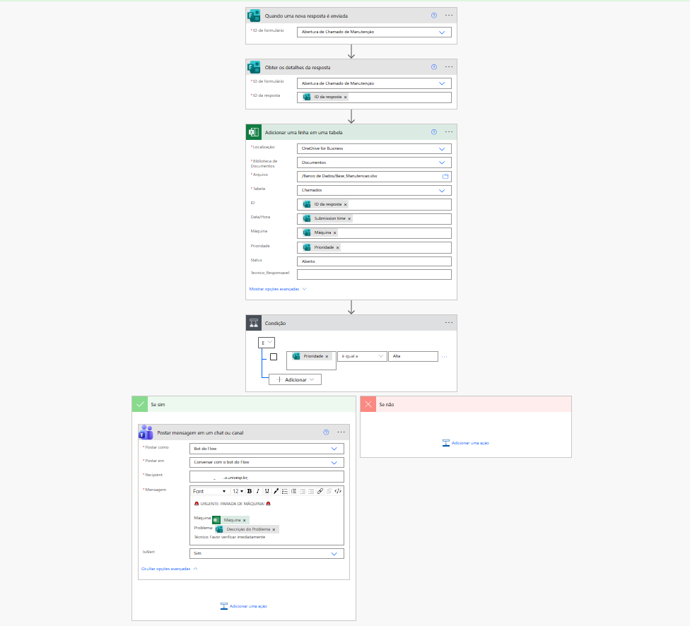
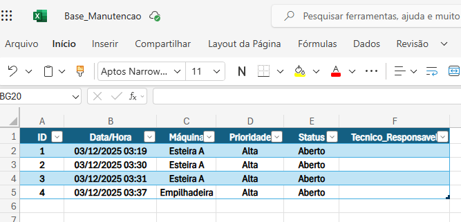

# 🔧 Sistema Integrado de Gestão de Manutenção (CMMS)

Solução *End-to-End* desenvolvida para otimizar o processo de manutenção industrial, conectando o operador no chão de fábrica diretamente à gestão estratégica via QR Code e automação.

## 📷 Visão Geral do Projeto

Este projeto demonstra o fluxo completo de dados: da abertura do chamado via celular até o alerta crítico para a equipe técnica.

| Abertura via Mobile (QR Code) | Alerta em Tempo Real (Teams) |
|:---:|:---:|
| <video src="https://user-images.githubusercontent.com/SEU_ID/preenchimento_do_formulario.mp4" controls="controls" style="max-width: 100%;"> | <video src="https://user-images.githubusercontent.com/SEU_ID/recebimento no teams.mp4" controls="controls" style="max-width: 100%;"> |
| *Operador reporta a falha na máquina* | *Bot notifica a equipe técnica instantaneamente* |

> **Nota:** Para visualizar os vídeos demonstrativos acima, certifique-se de estar visualizando este arquivo no GitHub.

### 🧠 A Lógica por Trás (Backend)
Abaixo, o fluxo de automação que processa as regras de negócio:

  
   
  <em>O robô analisa a prioridade e decide se dispara o alerta de crise.</em>

### 💾 Banco de Dados (Resultado)

  
   
  <em>Registro estruturado de todos os incidentes para auditoria e BI.</em>

---

## 🛠 Tecnologias Utilizadas
* **Microsoft Forms + QR Code:** Interface *mobile-first* para reporte rápido em campo.
* **Power Automate:** Orquestração de processos, lógica condicional e integração entre sistemas.
* **Microsoft Teams:** Canal de comunicação para redução de MTTR (Tempo Médio de Reparo).
* **Excel Online (OneDrive Business):** Banco de dados em nuvem para centralização das informações.

## ⚙️ Arquitetura da Solução
1.  **Captura (IoT Low-Code):** Cada máquina possui um QR Code exclusivo. Ao escanear, o operador acessa o formulário de reporte já contextado.
2.  **Triagem Automática:** O robô analisa a **Prioridade** do chamado.
    * `Se Prioridade == 'ALTA'`: Aciona o fluxo de emergência (Teams).
    * `Se Prioridade == 'BAIXA'`: Registra na base para planejamento (Backlog).
3.  **Registro e Rastreabilidade:** Todos os incidentes são gravados com timestamp e ID do operador no Excel Online.

---

## 🏗️ Como foi construído (Passo a Passo)

### 1. Interface de Campo
* Criação de formulário padronizado com campos de seleção (Máquina, Tipo de Falha) para padronizar os dados de entrada.
* Implementação de upload de fotos para evidência visual do problema.

### 2. Automação de Crise (Power Automate)
* **Gatilho:** *When a new response is submitted* para monitoramento contínuo.
* **Lógica Condicional:** Uso da ação *Condition* para filtrar chamados críticos.
* **Ação de Alerta:** Configuração do bot no Teams para enviar mensagem formatada (Adaptive Card simples) com as variáveis dinâmicas do problema.

### 3. Gestão de Dados
* Estruturação de tabela fato no Excel Online, garantindo que os dados estejam prontos para conexão futura com Power BI.

---

## 🚀 Impacto do Projeto
* **Agilidade:** Eliminação do tempo de deslocamento para reportar falhas.
* **Comunicação:** O alerta instantâneo garante que a equipe de manutenção atue no momento exato da quebra crítica.
* **Dados:** Fim das Ordens de Serviço em papel, permitindo análise histórica de falhas.
